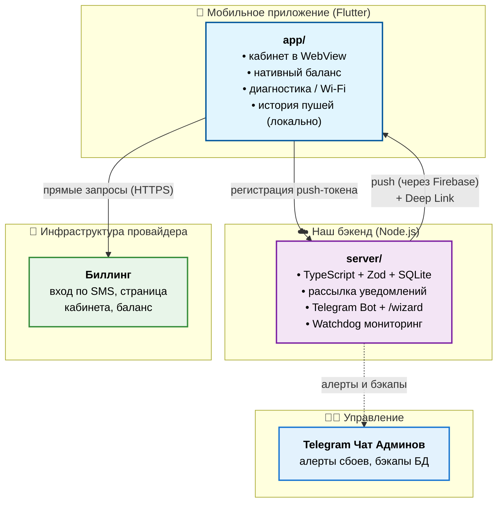

```text
⣿⣿⣿⣿⣿⣿⣿⣿⣿⣿⣿⣿⣿⣿⣿⣿⣿⣿⣿⣿⣿⣿⡿⠛⠋⠀⢀⣠⣴⣿
⣿⣿⣿⣿⣿⣿⣿⣿⣿⣿⣿⣿⣿⣿⣿⣿⣿⣿⣿⠟⠋⠁⠀⣀⣤⣾⣿⣿⣿⣿
⣿⣿⣿⣿⣿⣿⣿⣿⣿⣿⣿⣿⣿⣿⣿⣿⠟⠋⠀⠀⢀⣤⣾⣿⣿⣿⣿⣿⣿⣿
⣿⣿⣿⣿⣿⣿⣿⣿⣿⣿⣿⣿⠿⠋⠀⠀⠀⣠⣶⣿⣿⣿⣿⣿⣿⣿⣿⣿⣿⣿
⣿⣿⣿⣿⣿⣿⣿⣿⣿⣿⠟⠁⠀⠀⠀⣠⣾⣿⣿⣿⣿⣿⣿⣿⣿⣿⣿⣿⣿⣿
⣿⣿⣿⣿⣿⣿⣿⣿⣿⣏⠁⠀⠀⠀⢠⣾⣿⣿⣿⣿⣿⣿⣿⣿⣿⣿⣿⣿⣿⣿
⣿⣿⣿⣿⣿⣿⣿⣿⣿⣿⣷⡄⠀⠀⠀⠙⢿⣿⣿⣿⣿⣿⣿⣿⣿⣿⣿⣿⣿⣿
⣿⣿⣿⣿⣿⣿⣿⣿⣿⡿⠋⠀⠀⠀⠀⢀⣴⣿⣿⣿⣿⣿⣿⣿⣿⣿⣿⣿⣿⣿
⣿⣿⣿⣿⣿⣿⣿⣿⠏⠀⠀⠀⠀⢀⣴⣿⣿⣿⣿⣿⣿⣿⣿⣿⣿⣿⣿⣿⣿⣿
⣿⣿⣿⣿⣿⣿⡿⠁⠀⠀⠀⠀⢠⣾⣿⣿⣿⣿⣿⣿⣿⣿⣿⣿⣿⣿⣿⣿⣿⣿
⣿⣿⣿⣿⣿⠟⠀⠀⠀⠀⠀⣠⣿⣿⣿⣿⣿⣿⣿⣿⣿⣿⣿⣿⣿⣿⣿⣿⣿⣿
⣿⣿⣿⣿⠋⠀⠀⠀⠀⠀⢠⣿⣿⣿⣿⣿⣿⣿⣿⣿⣿⣿⣿⣿⣿⣿⣿⣿⣿⣿
⣿⣿⡿⠁⠀⠀⠀⠀⠀⢠⣿⣿⣿⣿⣿⣿⣿⣿⣿⣿⣿⣿⣿⣿⣿⣿⣿⣿⣿⣿
⣿⡿⠁⠀⠀⠀⠀⠀⠀⣾⣿⣿⣿⣿⣿⣿⣿⣿⣿⣿⣿⣿⣿⣿⣿⣿⣿⣿⣿⣿
⡟⠀⠀⠀⠀⠀⠀⠀⣸⣿⣿⣿⣿⣿⣿⣿⣿⣿⣿⣿⣿⣿⣿⣿⣿⣿⣿⣿⣿⣿
```

# ЛК Интерра


[](https://codespaces.new/verf1CT/Interra)

Мобильное приложение «Личный кабинет» для абонентов интернет-провайдера
**Интерра** (`interra.ru`, г. Первоуральск). Один код на iOS и Android (Flutter).
Показывает веб-кабинет, нативно подтягивает баланс, шлёт push-уведомления и даёт
полезные инструменты (диагностика сети, «кто в моём Wi-Fi», история уведомлений, deep links).

---

## Статус проекта (август 2026)

| Что | Состояние |
|-----|-----------|
| Само приложение | готово ✅ |
| Уведомления & Deep Links (в приложении) | работают, проверено на телефоне ✅ |
| История push в приложении | локальное хранение (SharedPreferences) ✅ |
| Android-подпись (для магазинов) | настроена ✅ |
| Бэкенд сервера уведомлений | TypeScript + Clean Architecture + Zod + Vitest (15 тестов) ✅ |
| Telegram Bot управления | командное меню + `/wizard` мастер рассылок + бэкапы БД ✅ |
| Watchdog мониторинг | авто-алерты сбоев (БД, RAM >450MB, uncaught Exception) в Telegram ✅ |
| Production Docker | Dockerfile (multi-stage) + docker-compose + NGINX ✅ |
| Сервер рассылки уведомлений | готово к запуску (`make docker-up`) 🚀 |

**Полная картина «кто что делает» — в [`docs/RELEASE_STATUS.md`](docs/RELEASE_STATUS.md).**

---

## Куда смотреть (навигация)

| Вы… | Смотрите |
|------|----------|
| **админ сервера** — поднять сервер в Docker | [`docker-compose.yml`](docker-compose.yml) и `make docker-up`. Пошагово: [`server/ADMIN.md`](server/ADMIN.md), [`server/README.md`](server/README.md) |
| **отвечаете за публикацию** в магазины | [`docs/STORE_CHECKLIST.md`](docs/STORE_CHECKLIST.md) — полный чеклист, [`docs/store/`](docs/store/) — тексты и анкеты витрин |
| **разработчик** | [`app/README.md`](app/README.md) — про приложение, [`docs/INSTALL_FLUTTER.md`](docs/INSTALL_FLUTTER.md) — окружение |
| **история изменений** | [`CHANGELOG.md`](CHANGELOG.md) — полная история всех изменений по версиям |

---

## Что это и как устроено (простыми словами)

Приложение — это личный кабинет провайдера в телефоне. Внутри три независимых части:

1. **Приложение ↔ биллинг** — вход по номеру телефона и SMS, показ кабинета и
   баланса. Идёт напрямую к биллингу провайдера, **наш сервер тут не участвует**.
2. **Приложение → наш сервер** — приложение сообщает серверу «вот моё устройство,
   шлите мне уведомления».
3. **Наш сервер → приложение / Telegram** — оператор из веб-панели или Telegram-бота
   рассылает уведомления (с поддержкой Deep Links на конкретные экраны).



## Состав репозитория

| Папка / Файл        | Что это                                                                       |
|---------------------|-------------------------------------------------------------------------------|
| `app/`              | Мобильное приложение (Flutter, iOS + Android) — **основной продукт**           |
| `server/`           | Бэкенд рассылки уведомлений (TypeScript/Node.js) + Telegram Bot + Watchdog    |
| `docker-compose.yml`| Оркестрация сервера и NGINX reverse-proxy для развёртывания в Docker          |
| `nginx.conf`        | NGINX конфигурация с поддержкой Gzip и пробросом заголовков SSL              |
| `CHANGELOG.md`      | История изменений по стандарту Keep a Changelog                               |
| `docs/`             | Статус релиза, деплой, настройка платформ, материалы для магазинов             |
| `.github/`          | CI (GitHub Actions): анализ, тесты, сборка APK + AAB и генерация релизов       |

---

## 🤖 Команды Telegram-Бота

Сервер содержит встроенного авторизованного Telegram-бота для управления системой:

- `🧙‍♂️ Пошаговая рассылка` / `/wizard` — интерактивный мастер (Заголовок → Текст → Deep Link → Предпросмотр → Отправка).
- `📊 Статистика` / `/stats` — сводка по устройствам (iOS/Android), uptime, RAM и размеру SQLite.
- `💾 Бэкап БД` / `/backup` — скачивание архива SQLite базы прямо в чат.
- `🏓 Пинг` / `/ping` — мгновенная проверка отклика SQLite и состояния сервера.
- `/push [--screen=diagnostics] <текст>` — быстрая массовая рассылка.
- `/send <логин> <текст>` — точечный push конкретному абоненту.
- `/find <логин/телефон>` — поиск устройства в базе данных.

---

## 🛡 Watchdog Авто-Мониторинг Сбоев

Бэкенд в фоновом режиме отслеживает здоровье системы (`watchdogService`):
- **SQLite**: при потере связи отправляется экстренный alert `🚨 CRITICAL ALERT: Потеряно соединение с SQLite БД!`.
- **RAM**: при превышении порога Heap >450MB высылается предупреждение `⚠️ WARNING ALERT`.
- **Исключения**: автоматическая отправка стек-трейса при `uncaughtException` и `unhandledRejection`.
- **Восстановление**: бот присылает `✅ RECOVERED`, когда компонент снова в норме.

---

## Технический статус

- Версия: **`1.0.0+2`** (единый источник — `app/pubspec.yaml`).
- Приложение: `flutter analyze` — 0 замечаний; `flutter test` — 36/36.
- Бэкенд: `npm run typecheck` — 0 ошибок TS; `npm run test` (Vitest) — 15/15 тестов пройдено; **Scalar UI + OpenAPI 3.1** по адресу `/docs`.
- Docker: готов мультистадийный `Dockerfile` + `docker-compose.yml`.

---

## Быстрый старт (для разработчика)

Самый простой путь — использовать интерактивное меню из корня:

```bash
make                                               # вызов графического цветного меню
make dev-server                                    # запуск бэкенда в dev-режиме
make dev-app                                       # запуск Flutter приложения
make test                                          # прогон всех тестов (Vitest + Flutter)
make docker-up                                     # запуск полного стека (Server + NGINX) в Docker
make docker-down                                   # остановка Docker-контейнеров
```

Или по папкам напрямую:

```bash
# приложение (Flutter)
cd app && flutter pub get && flutter run          # запуск на устройстве/эмуляторе
flutter analyze lib test && flutter test          # проверки
flutter build apk --release                        # Android-сборка (нужен Android SDK)

# бэкенд (TypeScript)
cd server
npm install
npm run dev                                        # режим разработки (tsx watch)
npm run test                                       # запуск Vitest тестов (15/15 PASSED)
npm run build && npm start                         # продакшн сборка и запуск
```
